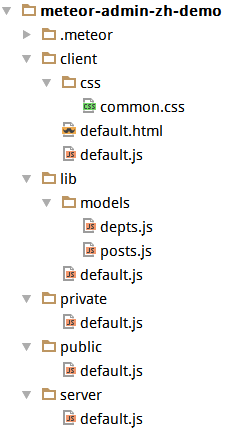

Meteor Admin 中文版
============

#### 1. Install ####
`git clone https://github.com/yinfxs/meteor-admin-zh-demo.git && cd meteor-admin-zh-demo && meteor`

#### 2. Config ####
  

* client：客户端模块  
* server：服务端模块  
* lib：公共模块  
* private：私有模块  
* public：公共资源  

#### 3. Source ####
yinfx:admin-zh：[https://github.com/yinfxs/meteor-admin-zh.git](https://github.com/yinfxs/meteor-admin-zh.git)   